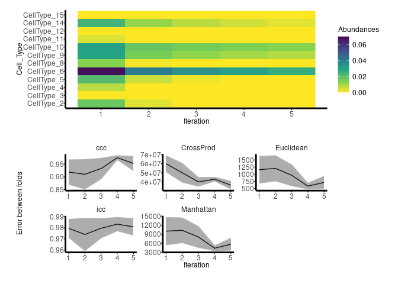

<!-- README.md is generated from README.Rmd. Please edit that file -->

## **SSDRnaSeq (Semi-Supervise Deconvolution of RnaSeq)**

Is a software package that has been meticulously designed to address the
persistent challenges that cellular deconvolution methods have faced for
years. One of its key features is its ability to overcome the
limitations posed by incomplete reference arrays, which have hampered
the accuracy and efficiency of many existing methodologies. In doing so,
SSDRnaSeq hopes to contribute to the advancement of RNA-seq analysis,
offering a more complete and reliable solution for better elucidating
the complexities of cell composition and gene expression.

SSDRnaSeq’s core functionality lies in its iterative deconvolution
process, which continues until convergence is reached. This approach
involves joint updates of the reference matrix, which may contain
missing cell populations, and the cell population abundance matrix,
which contains newly discovered populations. Like other deconvolution
methods, SSDRnaSeq starts by fundamentally modelling the deconvolution
problem. It relies on established techniques such as CiberSortX, DCQ or
others for the supervised aspect, while using non-negative matrix
factorization (NMF) decomposition for the unsupervised component. This
hybrid approach enables SSDRnaSeq to provide a robust and versatile
solution for unravelling complex RNA-seq data.

#### Running cibersortx to deduce the fractions of the different cell populations requires convigurations following the steps below:

`Step 1:`

Install `Docker Desktop` :
(<https://www.docker.com/products/docker-desktop>)

Open Docker Desktop on your local computer and log in. Then, you open a
terminal, and you type the following command:
`\> docker pull cibersortx/fractions`

`Step 2:`

The next thing you need is a token that you will provide every time you
run the CIBERSORTx executables.

You can obtain the token from the CIBERSORTx website:
(<https://cibersortx.stanford.edu/getoken.php>).

Please note that each token is uniquely tied to your user account, and
tokens are good for a specific time interval from date of request, so
you will need to request a new token when an existing one has expired.

`Step 3:`

Once you have pulled the CIBERSORTx executable from Docker, and you have
obtained a token from the CIBERSORTx website, you now have access to the
CIBERSORTx Fractions executable and can run it following the
instructions below.

### Once the configuration is complete and docker is running, you can run `SSDRnaSeq` with the token from the CIBERSORTx website `cibersortx_email` and `cibersortx_token` using the main function `SSDRnaSeq()`.

## Installation

``` r
remotes::install_github("kalidouBA/SSDRnaSeq")
```

``` r
library(SSDRnaSeq)
#> Registered S3 methods overwritten by 'registry':
#>   method               from 
#>   print.registry_field proxy
#>   print.registry_entry proxy
library(NMF)
#> Le chargement a nécessité le package : registry
#> Le chargement a nécessité le package : rngtools
#> Le chargement a nécessité le package : cluster
#> NMF - BioConductor layer [OK] | Shared memory capabilities [NO: bigmemory] | Cores 2/2
#>   To enable shared memory capabilities, try: install.extras('
#> NMF
#> ')
```

## Example

### Data simulation

``` r
simulation <- SSDRnaSeq::simulation(loi = "gauss", scenario = " ", nGenes = 100, nCellsType = 15)
ref <- simulation$reference
bulk <- simulation$bulk
prop <- simulation$prop
```

### Let’s consider 3 random populations of cells, chosen at random from the reference matrix, as unknown and first analyse the significant impact on the accuracy and reliability of cell deconvolution methods.

``` r
set.seed(2101)
cellTypeOut <- sample(1:ncol(ref), 3)
refDataIncomplet <- ref[,-cellTypeOut]
```

### Proportion estimates using *k=5* cross-validation folds and *10* iterations to be performed during the cell deconvolution process with joint estimation of the reference matrix *W* and abundances *P*. Each iteration typically involves running the *DCQ* deconvolution algorithm.

``` r
res <- SSDRnaSeq::SSDRnaSeq(reference = refDataIncomplet, bulk = bulk, k_folds = 5, nIteration = 5, methodDeconv ="DCQ")
#> [1] "selecting only specific markers that we want to use for our analysis"
#> [1] "running deconvolution on row.names(refIntersect)"
#> [1] "selecting only specific markers that we want to use for our analysis"
#> [1] "running deconvolution on row.names(refIntersect)"
#> [1] "selecting only specific markers that we want to use for our analysis"
#> [1] "running deconvolution on row.names(refIntersect)"
#> [1] "selecting only specific markers that we want to use for our analysis"
#> [1] "running deconvolution on row.names(refIntersect)"
#> [1] "selecting only specific markers that we want to use for our analysis"
#> [1] "running deconvolution on row.names(refIntersect)"
```

``` r
plot(res)
```


